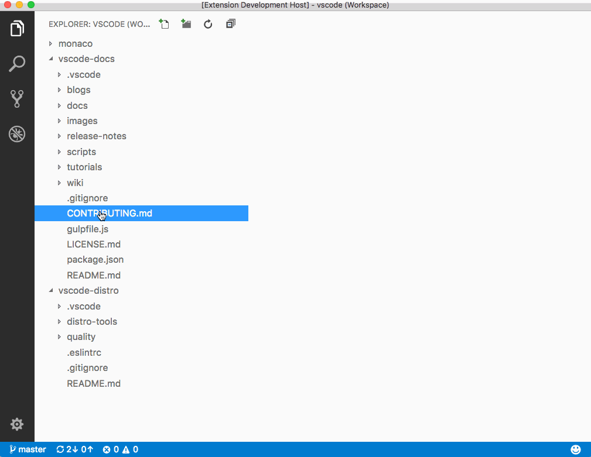

# API Uptime & Incident Tracker

Una libreria plug-and-play per **Fastify** ed **Express** che traccia errori runtime, li salva in SQLite e offre una dashboard HTML moderna (con grafici e Tailwind CSS) su una route a scelta (default `/status`).  
La dashboard mostra:
- Uptime per giorno (chart)
- Uptime medio
- Ultimi incidenti

---

## Installazione

```sh
npm install api-uptime-tracker
```

---

## Utilizzo con **Express**

```ts
import express from 'express';
import { errorTrackerExpress, startErrorTracker } from 'api-uptime-tracker';

await startErrorTracker(); // inizializza il DB e il tracking

const app = express();

// ...altri middleware e route...

// Registra il tracker (default route: /status)
app.use(...errorTrackerExpress());

// oppure, per una route custom:
app.use(...errorTrackerExpress('/monitor'));

app.listen(3000);
```

---

## Utilizzo con **Fastify**

```ts
import Fastify from 'fastify';
import { errorTrackerFastify, startErrorTracker } from 'api-uptime-tracker';

await startErrorTracker();

const app = Fastify();

// ...altre route...

// Registra il plugin (default route: /status)
await app.register(errorTrackerFastify);

// oppure, per una route custom:
await app.register(errorTrackerFastify, { route: '/monitor' });

await app.listen({ port: 3000 });
```

---

## Dashboard

La dashboard è accessibile su `/status` (o la route scelta) e mostra:

- **Uptime giornaliero**: grafico a barre (Tailwind + Chart.js)
- **Uptime medio**: valore numerico
- **Ultimi incidenti**: lista dettagliata



---

## Personalizzazione

- Cambia la route passando un parametro a `errorTrackerExpress(route)` o `{ route }` a `errorTrackerFastify`.
- Puoi modificare lo stile del frontend editando il file HTML generato.

---

## Requisiti

- Node.js 18+
- SQLite (incluso, nessuna configurazione necessaria)

---

## Licenza

MIT
